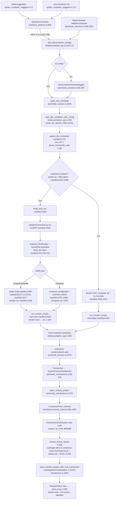

# 01 — Architecture actuelle du support Dev Containers

Base : `main` = `16c9aa7ea6` (2026-09-22). Chemins relatifs à `crates/`. Abréviations : `dc/` = `dev_container/src`,
`manifest` = `dc/devcontainer_manifest.rs`, `rt/` = `remote/src/transport/docker.rs`, `rp/` = `recent_projects/src`.
Sources : trois inventaires parallèles (flux, processus, chemins), puis vérification par sondage de chaque constat
porteur (lignes relues à la main : `dc/docker.rs:365-386`, `manifest:1696-1722, 1897-1916, 1590-1620, 3027-3035`,
`rt:640-652`, `remote/src/remote_identity.rs:18-55`, `rp/recent_projects.rs:505-522`, `rp/remote_connections.rs:94-98`,
les `temp_dir()` et `wait_for`).

## 0. En une phrase

Le code suppose partout **client Zed = hôte du CLI docker = vue du démon** : 30 sites de lancement de processus
en production, tous locaux, et aucune abstraction d'exécution par laquelle ils passent tous ; les chemins du client
servent de sources de bind-mount, de labels d'identité et de contexte de build ; l'UI **refuse** d'ouvrir un
Dev Container depuis un projet distant (`rp/recent_projects.rs:508-521`).

Taille : `dc/` ≈ 15 070 lignes (manifest 8 718, json 1 757, lib 1 656, docker 1 347, api 676, oci 420,
features 317, command_json 181).

## 1. Flux complet

### Étapes (détail)

| # | Étape | Points clés | Réf. |
|---|---|---|---|
| 1 | Entrées UI & découverte | `.devcontainer/devcontainer.json`, `.devcontainer//devcontainer.json`, `.devcontainer.json` ; **seul le premier worktree visible** est scanné | `dc/devcontainer_api.rs:150-242` |
| 2 | Contexte | `use_podman`/`use_buildkit` depuis settings `remote.*` ; env projet via `local_directory_environment` (shell **local**) ; `fs` = `app_state().fs` (**RealFs local**) | `dc/lib.rs:98-155`, `settings_content/src/settings_content.rs:1362-1372` |
| 3 | Parse & variables | JSONC `serde_json_lenient` ; `${localWorkspaceFolder}`, `${containerWorkspaceFolder}`, `${devcontainerId}`, `${localEnv:…}` substitués sur le JSON brut ; `${containerEnv:…}` seulement dans `remoteEnv` au runtime | `dc/devcontainer_json.rs:265`, `manifest:149-226` |
| 4 | `devcontainerId` | hash `DefaultHasher` des labels identifiants — stabilité inter-versions Rust non garantie | `manifest:113-124` |
| 5 | Réutilisation | `docker ps -a --filter label=devcontainer.local_folder=<chemin client> --filter label=devcontainer.config_file=…` ; >1 résultat → `MultipleMatchingContainers` | `dc/docker.rs:256-266, 468-485`, `manifest:126-138, 2498` |
| 6 | Build image/Dockerfile | `buildx build --load` **codé en dur** (`manifest:1916`) même sans buildx détecté ou avec podman ; image sans features → pas de build | `manifest:1583-1620, 1897-2004` |
| 7 | Features | ordre : seul `overrideFeatureInstallOrder`, sinon alphabétique (`installsAfter`/`dependsOn` ignorés) ; OCI : 1ʳᵉ couche seulement | `manifest:3041`, `dc/oci.rs:35-138`, `manifest:563-573` |
| 8 | UID | `id -u`/`id -g` **locaux** → `NEW_UID`/`NEW_GID` ; désactivé sous Windows client | `manifest:1644-1787` |
| 9 | Compose | `compose config` (YAML) → `docker_compose_build.json` + `docker_compose_runtime.json` (noms fixes dans `temp_dir`) → `compose build` / `up -d` | `manifest:1071-1402, 2023-2051`, `dc/docker.rs:274-356` |
| 10 | `docker run` | `runArgs`/`build.options` verbatim ; `--mount source=<chemin client>` ; podman : `--userns=keep-id`, `--security-opt=label=disable` ; `forwardPorts` numériques seulement | `manifest:2159-2295` |
| 11 | Lifecycle | `initializeCommand` : client, **seulement si build** (pas sur réutilisation), exit≠0 seulement loggé ; onCreate/updateContent/postCreate si nouveau ; postStart via marqueur ; postAttach au spawn, **pas** aux reconnexions ; lifecycle des **features/métadonnées d'image jamais exécutés** (`features.rs:280-286` ne fait que recopier) ; `waitFor` ignoré | `manifest:2305-2430`, `dc/devcontainer_json.rs:394-421` |
| 12 | Serveur distant | défaut `upload_binary_over_docker_exec: false` → curl/wget **dans** le conteneur ; repli : download local + `docker cp -a` + `chown user:user` | `rp/remote_connections.rs:96`, `rt:205-483, 571-642` |
| 13 | Proxy & persistance | `docker exec -i … proxy --identifier` ; identité `docker:{user}@{name}:{container_id}` (id **éphémère**, cf. #56576) ; clé DB inclut `container_id` | `rt:665-750`, `remote/src/remote_identity.rs:20-24, 49-53`, `workspace/src/persistence.rs:1700-1833` |
| 14 | Réouverture (récents) | ouvre directement avec le `container_id` persisté : ni `docker start`, ni hooks, ni rebuild | `rp/recent_projects.rs:2191-2208` |

### Types principaux

| Type | Où | Rôle |
|---|---|---|
| `DevContainerContext` | `dc/lib.rs:98` | dossier projet, podman/buildkit, `fs`, http, env |
| `DevContainerManifest` (privé) | `manifest:50` | orchestrateur parse→build→run→hooks |
| `DevContainer` | `dc/devcontainer_json.rs:202` | modèle serde de devcontainer.json |
| `Docker` / trait `DockerClient` | `dc/docker.rs:193 / 488` | wrapper CLI ; échappatoire `docker_cli()` utilisée par le manifest pour fabriquer ses propres `Command` |
| trait `CommandRunner` | `dc/command_json.rs:25` | seule impl. de prod : `DefaultCommandRunner` (local) |
| `settings::DevContainerConnection` | `settings_content/src/settings_content.rs:1379` | résultat vers l'UI (pas de champ hôte) |
| `DockerConnectionOptions` | `rt:48` | name, container_id, remote_user, upload flag, podman, remote_env — **pas d'hôte** |
| `DockerExecConnection` | `rt:57` | `RemoteConnection` par `docker exec` |
| `RemoteConnectionIdentity::Docker` | `remote/src/remote_identity.rs:20` | identité de persistance |

## 2. Lancements de processus

Tous passent par `util::command::Command` (wrapper `smol::process::Command`, `util/src/command.rs:28-43` ; sous
Windows : seulement `CREATE_NO_WINDOW`). **Aucun `.envs()`** dans `dc/` : l'env du projet ne sert qu'aux substitutions.
Total production : **30 sites** (17 `dc/`, 6 `rt/`, 6 `remote/src/transport.rs` en build dev uniquement, 1 `rp/`)
+ 16 invocations via exécuteurs génériques.

| Site | Binaire / args | Devrait tourner sur | Tourne sur | Remarque |
|---|---|---|---|---|
| `dc/devcontainer_api.rs:309-317` | `docker|podman --version` | hôte moteur | client | seule vérif. de présence |
| `dc/docker.rs:218-221` | `docker buildx version` | hôte moteur | client | détecte le buildx du client |
| `dc/docker.rs:240,257,269,403` | `pull`, `ps -a --filter`, `inspect`, `start` | hôte moteur | client | `inspect` sans `--` |
| `dc/docker.rs:275,321` | `compose -f … config/build` | hôte moteur | client | fichiers compose lus sur le client |
| **`dc/docker.rs:365-386`** | `exec … sh -c "<prog args>.join(' ')"` | conteneur | client→conteneur | **aucun quoting** (vérifié) |
| `dc/devcontainer_json.rs:380-405` | `initializeCommand` (`/bin/sh -c` ou argv) | hôte des sources | **client** | `/bin/sh` absent sur Windows natif |
| **`manifest:1699,1717`** | `id -u`, `id -g` | hôte moteur | **client** | contourne `CommandRunner` (vérifié) |
| `manifest:1750,1861,1914,2028,2166` | `build` UID / feature-content / `buildx build` / `compose up` / `run` | hôte moteur | client | `runArgs`, `build.options` verbatim |
| `rt:440-471` | `cp -a`, `exec chown` | CLI → conteneur | client | repli seulement |
| `rt:511-568` | `exec [-w] -u -e … <prog> <args>` | conteneur | client→conteneur | argv propre (env filtré `rt:884-895`) |
| `rt:646-649` | `kill <pid>` | client | client | `kill` absent sur Windows natif (vérifié) → erreur |
| `rt:688-725` | `exec -i … proxy` | conteneur | client→conteneur | |
| `rt:779-845` | `build_command` → `CommandTemplate` docker | conteneur | client→conteneur | terminaux/tâches |
| `rp/remote_connections.rs:479-496` | `exec … test -e` | conteneur | client→conteneur | |
| `remote/src/transport.rs:329-431` | cargo / rustup / zigbuild / gzip / PowerShell | client (dev) | client | `Compress-Archive` : quotes non échappées |

### Risques d'injection / de quoting (tous vérifiés ou relus)

1. `dc/docker.rs:377-386` — `sh -c` sur `join(" ")` : la forme tableau passe par un shell (contraire à la spec) et
   la forme chaîne devient `sh -c "/bin/sh -c echo post-attach"` → le script est coupé au 1ᵉʳ espace (**bug fonctionnel**).
2. `manifest:3365-3369 → 3396` — même `join(" ")` dans le script marqueur postStart.
3. `manifest:3027-3035` — `get_ent_passwd_shell_command` échappe `'` en `\'` à l'intérieur de quotes simples : invalide en sh.
4. `manifest:1835-1838` — `ENV {key}={value}` non échappé dans `updateUID.Dockerfile` (saut de ligne → instruction injectée).
5. `manifest:880-894` — entrypoint `sh -c` par concaténation des `entrypoint` de features.
6. Options docker (argv, sans shell) : `runArgs` (`manifest:2182-2184`), `build.options` (`manifest:1971-1973`),
   `--mount` non échappé (virgule dans un chemin, `dc/devcontainer_json.rs:77-96`), `inspect` sans `--` (`dc/docker.rs:270`).

Référence saine à réutiliser : `rt:365-387` (`ShellKind::Posix.try_quote`).

## 3. Chemins et espaces

Espaces : **A** client Zed · **B** hôte du CLI/moteur · **C** vue du démon (sources de bind-mount) · **D** conteneur.
Nuance : tout ce que le CLI **empaquette** (contexte de build, `-f`, `--build-context`, source de `docker cp`) est en **B** ;
seules les sources de bind-mount sont en **C**.

| Chemin | Réf. | Aujourd'hui | Correct en distant | Conversion actuelle |
|---|---|---|---|---|
| dossier projet / config | `dc/lib.rs:109`, `manifest:75-105` | A (lu par `Fs` local) | là où vit le projet (A ou B) | aucune |
| labels `local_folder` / `config_file` | `manifest:126-136, 3449-3465` | A | B (comme le CLI de référence) | Windows client : `/`→`\`, lecteur minuscule |
| `${localWorkspaceFolder}` | `manifest:180, 2102` | A | C si source de mount, B sinon | `\`→`/` à la substitution seulement |
| source du mount workspace | `manifest:2137-2157` | A brut | **C** | **aucune** (pas de `/run/desktop/mnt/host`, `/mnt/wsl`…) |
| mounts features/metadata/`mounts` | `manifest:824-870, 2209-2214` | tel quel | C | aucune |
| contexte de build | `manifest:2656-2667` | A (`is_absolute()` sémantique client) | B | `/abs` posix non reconnu absolu sur client Windows |
| `temp_dir()/devcontainer-zed/…` (features, Dockerfile.extended, updateUID, feature-content) | `manifest:444-688, 1737-1739, 1851` | A | B | `display()` ; jamais nettoyé |
| `docker_compose_build.json` / `_runtime.json` | `manifest:1170, 1269, 1336` | A, **noms fixes** | B | collision possible entre projets |
| cwd `initializeCommand` | `dc/devcontainer_json.rs:402` | A | hôte (à trancher en P3) | aucune |
| workdir hooks, marqueur postStart | `manifest:2332, 3375-3383` | D | D | — |
| binaire remote_server (source `docker cp`) | `rt:244, 325-328, 417` | A | B | `smol::fs::metadata` local |
| destinations serveur | `rt:231-295, 493` | D | D | `RelPath` + `path_style` |
| template extrait | `dc/devcontainer_api.rs:366` | A | A (correct) | — |

`cfg(windows)` (`manifest:708-711, 1644-1687, 3449-3465`) teste l'**OS du client**, pas celui de l'hôte moteur.
Aucune lecture de `DOCKER_HOST`, `DOCKER_CONTEXT`, `docker.sock`, `SSH_AUTH_SOCK` ; l'env hérité du process Zed
est le seul canal (un `DOCKER_HOST` exporté fonctionne donc « par accident » pour le CLI, mais pas pour les mounts ni `id -u`).

## 4. Hypothèses vérifiées

| # | Hypothèse | Verdict | Preuve |
|---|---|---|---|
| H1 | Le CLI docker est toujours invoqué sur le client | ✅ | tous les sites §2 ; `rt:839-844` (`program: docker_cli`) ; ni `ssh`/`wsl.exe`, ni `--context`/`-H` |
| H2 | Fichiers générés écrits dans `temp_dir` local puis passés au build | ⚠️ | vrai pour features/Dockerfile/compose/updateUID ; **faux** pour les hooks (en ligne via `sh -c`) |
| H3 | Le workspace doit exister sur le FS local | ✅ | `manifest:77, 2541, 2558, 2609, 2146` ; garde `rp/recent_projects.rs:508` |
| H4 | `waitFor` parsé mais ignoré | ✅ | champ privé `dc/devcontainer_json.rs:243`, seulement recopié dans le label (`manifest:3418`) ; idem `hostRequirements`, `userEnvProbe`, `shutdownAction`, `portsAttributes` |
| H5 | Upload du serveur par `docker cp` depuis un chemin local | ⚠️ | défaut = téléchargement **dans** le conteneur (`rp/remote_connections.rs:96`, `rt:296-323`) ; `docker cp` en repli |
| H6 | Point d'abstraction unique pour les appels docker | ❌ | `DockerClient` + `CommandRunner` partiels, contournés (`manifest:1699,1717`, `dc/command_json.rs:35,52`, `dc/devcontainer_api.rs:309`, `dc/docker.rs:218`) ; transport `rt/` séparé |
| H7 | Chemins Windows convertis pour les bind-mounts | ❌ | source brute `manifest:2146` ; `MountDefinition::fmt` ne convertit rien |
| H8 | L'identité de connexion n'inclut pas l'hôte du moteur | ✅ | `remote/src/remote_identity.rs:20-24, 53` ; `rt:48-55` sans champ hôte |

Écarts vs hypothèses initiales du plan : `temp_dir()` = **4** sites de production dans le manifest (+1 test, `manifest:4172`)
+ `dc/devcontainer_api.rs:366`, soit 5 au total, pas 5 dans le manifest. `wait_for` : « parsé-ignoré » confirmé.

## 5. Défauts constatés sur `main` (indépendants du distant)

Candidats à des PRs de correction « une seule chose » (à recouper avec les PRs ouvertes en P6 : #62271, #63034, #63391…).

| Défaut | Réf. | Gravité |
|---|---|---|
| Hooks : `join(" ")` sans quoting (cassé pour la forme chaîne, injection pour la forme tableau) | `dc/docker.rs:377-386`, `manifest:3365` | haute |
| Identité persistée sur `container_id` éphémère (#56576) | `remote/src/remote_identity.rs:53` | haute |
| Réouverture depuis les récents : pas de `docker start` | `rp/recent_projects.rs:2191-2208` | moyenne |
| `buildx` codé en dur (podman / sans BuildKit) | `manifest:1916` | moyenne |
| Lifecycle des features / métadonnées d'image jamais exécutés | `features.rs:280-286`, `manifest:2322-2428` | moyenne (conformité) |
| `initializeCommand` : sauté sur réutilisation, exit≠0 ignoré, `/bin/sh` sous Windows | `manifest:2308`, `dc/devcontainer_json.rs:366-416` | moyenne |
| `kill` absent sous Windows natif | `rt:646` | moyenne |
| Échappement `\'` invalide ; `ENV` non échappé | `manifest:3027-3035, 1835-1838` | basse (entrée de confiance) |
| Fichiers compose temporaires à noms fixes, `temp_dir` jamais nettoyé | `manifest:1170, 1269, 1336, 444` | basse |
| `devcontainerId` via `DefaultHasher` | `manifest:113-124` | basse |
