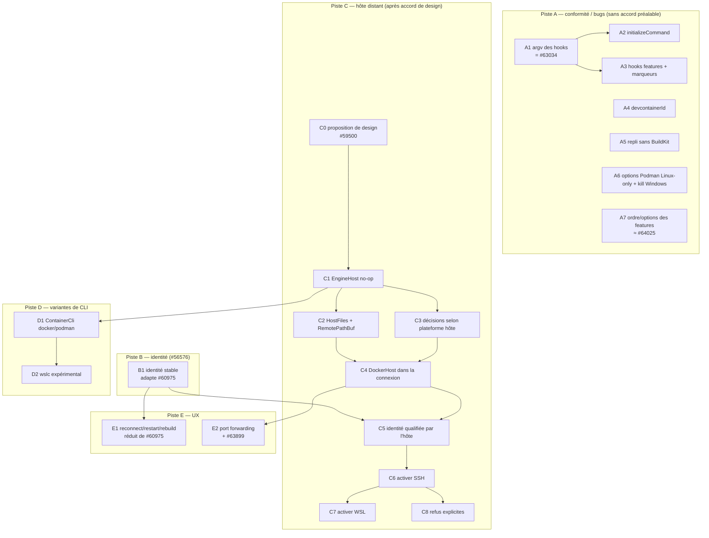

# 06 — Pile de PRs et coordination

Base : `05-target-architecture.md`, ADR-001…010, `03-spec-compliance.md` §13, `02-overlap-matrix.md` §7.
Rien n'est ouvert ni posté. Tailles estimées en lignes de code hors tests (ordre de grandeur).

## 0. Contraintes amont qui façonnent la pile (`CONTRIBUTING.md`)

- Les **fonctionnalités** doivent être confirmées par le staff avant PR (discussion d'abord) ; les **bugfixes** sont bienvenus directement.
  → Piste A (bugs/conformité) et B (#56576) peuvent partir tout de suite ; la piste C (distant) attend un accord de design.
- **3 PRs ouvertes maximum par auteur** ; « une seule chose » par PR ; tests obligatoires ; pas de « giant refactorings ».
- Politique IA : humain qui comprend le code ; messages aux mainteneurs **écrits par un humain** (texte généré cité et signalé).
- Constat : aucun mainteneur n'a encore commenté les PRs dev containers ouvertes (`raw/INDEX.md`) ; auteur principal du crate : KyleBarton
  (23 commits depuis 2026-01, `git shortlog`) — rôle dans l'équipe non vérifié.

## 1. Vue d'ensemble



## 2. Détail des PRs

| ID | Titre (anglais, style Zed) | Contenu | Dépend de | Taille | Tests | Reprend / coordonne |
|---|---|---|---|---|---|---|
| **A1** | `dev_container: Preserve lifecycle command arguments` | `docker exec … <argv>` sans `join` ; forme chaîne intacte ; même correctif dans le script marqueur postStart | — | S | argv exact de `run_docker_exec` pour chaîne/tableau/objet ; régression #62964 | **#63034 (pupeno)** et #62271 : **soutenir/relire l'existant plutôt que dupliquer** |
| **A2** | `dev_container: Run initializeCommand on every open and fail on error` | exécution avant la recherche du conteneur ; code ≠ 0 fatal ; `cmd /c` sur Windows | — | S | conteneur existant ⇒ exécuté ; exit 1 ⇒ erreur ; Windows ⇒ `cmd` | **#63391** (forme chaîne Windows) |
| **A3** | `dev_container: Run feature and image lifecycle hooks` | hooks des métadonnées d'image et des features, dans l'ordre spec ; marqueurs `.onCreate/.updateContent/.postCreateCommandMarker` ; forme objet parallèle | A1 | M | ordre fusionné ; marqueurs (conteneur recréé vs redémarré) ; échec ⇒ arrêt | — |
| **A4** | `dev_container: Compute devcontainerId per spec` | sha256 + base32 (52 car.) | — | S | vecteurs de test issus de l'algorithme spec/CLI | — |
| **A5** | `dev_container: Build without BuildKit when buildx is unavailable` | repli image temporaire pour image/Dockerfile | — | M | commande générée avec/sans buildx | — |
| **A6** | `dev_container: Apply Podman user namespace options on Linux only` + `remote: Stop docker proxy without external kill` | deux PRs S | — | S+S | options selon plateforme ; arrêt proxy sous Windows | — |
| **A7** | `dev_container: Order features by installsAfter and dependsOn` | tri topologique + options tableau/nombre | — | M | graphes de features ; cycles | **#64025** (options) |
| **A8** | *(en suspens)* `dev_container: Persist only remoteEnv for dev container connections` | ADR-008 | — | S | — | **décision utilisateur : rien pour l'instant** |
| **B1** | `Give dev containers a stable identity across rebuilds` | clé `(host=local, root, config, user)` ; UPDATE runtime ; migration en fin de liste ; `""`=absent ; normalisation des labels | — | M | rebuild ⇒ même `RemoteConnectionId` ; threads retrouvés ; migration | **#60975 (alex-berger)** : proposer de réduire sa PR à ce morceau |
| **C0** | *(discussion, pas de code)* | proposition de design (§3) dans #59500 | — | — | — | alexdhill, pupeno, alex-berger |
| **C1** | `dev_container: Route engine commands through an EngineHost` | `EngineHost::Local` seulement ; tous les sites (y c. `id`, `initializeCommand`, `docker_cli()`) | C0 | M | **égalité d'argv avant/après** sur tous les sites (fixtures `07`) | fusion `DevContainerHost` (#62680) / `ProjectCommandBuilder` (pupeno-wsl) |
| **C2** | `dev_container: Read and stage build files through the engine host` | `HostFiles` ; `BuildDir` unique et nettoyé ; `RemotePathBuf::join/parent/file_name` | C1 | M | faux `RemoteConnection` : commandes `cat`/`mktemp`/`rm` ; contenu par stdin | `ProjectHost` (pupeno-remote), réduit |
| **C3** | `dev_container: Decide UID and labels from the engine host platform` | ADR-007 | C1 | S | client Windows + hôte Linux ⇒ UID aligné | pupeno-wsl/pupeno-remote ; corrige le test rouge de #62680 |
| **C4** | `remote: Let docker connections run through a host connection` | `DockerHost` + pool + `docker_command()` + upload par flux ; inactif tant que C6 n'est pas mergé | C2, C3 | L | faux hôte : proxy, upload, terminal ; sérialisation `serde(default)` | **#62680 (alexdhill)** |
| **C5** | `Qualify dev container identity with its engine host` | étend B1 avec `engine_host_key` | B1, C4 | S | deux hôtes, même chemin ⇒ identités distinctes ; sans secret | #62680 × #60975 |
| **C6** | `Open dev containers from SSH projects` | lève le refus pour SSH (hôte POSIX) ; UI | C5 | M | e2e manuel T4 ; tests avec faux SSH | #62680 |
| **C7** | `Open dev containers from WSL projects` | idem WSL ; message si aucun moteur dans la distro | C6 | S | e2e T2/T3 | pupeno-wsl / pupeno-remote |
| **C8** | `dev_container: Explain unsupported dev container setups` | ADR-009 (T4w, T5, T6b, compose+wslc) | C1 | S | chaque motif | pupeno-wsl (`unsupported_reason`) |
| **D1** | `dev_container: Detect Docker or Podman CLI variant` | `ContainerCli` ; réglage `dev_container_cli` ; `use_podman` conservé | C1 | M | détection via `-v` (fixtures) | — |
| **D2** | `dev_container: Experimental WSL Containers (wslc) support` | ADR-006 Wslc ; derrière réglage | D1 | M | contrats sur sorties `wslc` enregistrées | — |
| **E1** | `Add dev container reconnect, restart and rebuild actions` | sous-ensemble de #60975, via `EngineHost` ; compose ; rebuild non destructif | B1 (C4 pour le distant) | M | — | #60975 |
| **E2** | `Forward dev container ports through the engine host` | — | C4 | M | — | #62680, #63899 |

Taille : S < 150, M 150–500, L 500–1000 lignes hors tests.

## 3. Ordre de soumission compatible avec « 3 PRs ouvertes par auteur »

| Vague | PRs | Condition |
|---|---|---|
| 1 | A2, A4, B1 (ou soutien à #63034/#63391/#60975 si leurs auteurs acceptent de réduire) | aucune |
| 2 | A3, A5, A6 | A1 mergée (#63034) |
| 3 | C1, C3, A7 | accord de design sur C0 |
| 4 | C2, C4, D1 | C1 mergée |
| 5 | C5, C6, C8 | C4 mergée |
| 6 | C7, D2, E1 | C6 mergée |

Répartition proposée aux auteurs existants (à négocier dans C0, jamais imposée) : pupeno → A1 (#63034), C7 ;
alexdhill → C4, C6, E2 ; alex-berger → B1, E1 ; autres PRs ouvertes (#63391, #64025, #63899) : les soutenir.

## 4. Brouillon du message de coordination (C0) — NON POSTÉ

> **À réécrire par toi, avec tes mots.** `CONTRIBUTING.md` demande que les messages aux mainteneurs soient écrits par un
> humain ; si tu gardes des passages de ce brouillon, mets-les en citation et indique qu'ils sont générés par IA.
> Lieu suggéré : issue #59500 (suivi officiel de la demande), en mentionnant #62680, #60975, #56576 et les branches de pupeno.

```text
Hi all — I've been reading the dev container code on main and the open work around remote hosts
(#62680 by @alexdhill, pupeno's wsl-devcontainers / remote-devcontainer branches, and #60975 by
@alex-berger for #56576). They overlap heavily: every pair of them conflicts in 3–16 files, and
each introduces its own "run docker on the project host" abstraction.

Before anyone writes more code, could we agree on one shape? Proposal:

1. One execution type in dev_container: EngineHost { Local, Remote(Arc<dyn RemoteConnection>) },
   delegating to RemoteConnection::build_command (no new transport, no hand-made quoting, identical
   argv for local projects).
2. Docker connections carry a flat, non-recursive host (DockerHost { Local, Ssh, Wsl }, serde
   default = Local), so creation and the exec/proxy connection always use the same engine.
3. A stable identity keyed on (engine host, project root, config file, remote user), with
   container_id as a runtime attribute — this fixes #56576 and extends to remote hosts.
4. Host-platform decisions (UID, labels, cmd vs sh) instead of cfg(windows) on the client.

Suggested order: bug fixes first (#63034 for #62964, #63391, initializeCommand on every open),
then the identity fix, then a no-op EngineHost refactor, then SSH, then WSL. Each step keeps
local behaviour unchanged and ships with tests.

Would the team be open to this direction? If so, I'm happy to coordinate with the authors above
on who takes which piece rather than opening yet another competing PR.
```
