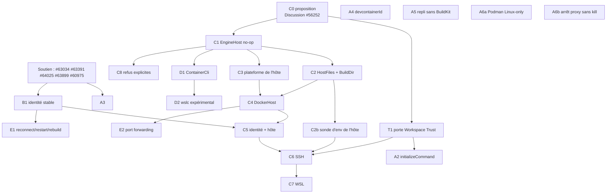

# 06 — Pile de PRs et coordination

Base : `05-target-architecture.md`, ADR-001…011, `03-spec-compliance.md` §13, `02-overlap-matrix.md` §7.
Révisé après la revue adverse (`08` §5 : P-1…P-5, F-2, F-1). Rien n'est ouvert ni posté. Tailles estimées hors tests.

## 0. Contraintes amont

- `CONTRIBUTING.md` :
  - **features** confirmées par le staff avant toute PR ; les propositions se font dans une **Discussion**, pas dans une issue (`CONTRIBUTING.md:33, 53-55`) ;
  - bugfixes bienvenus directement ; une PR « not obviously great » est fermée (`:98-100`) ;
  - **3 PRs ouvertes max par auteur** ; une seule chose par PR ; tests obligatoires ; pas de « giant refactorings » ;
  - politique IA : un humain comprend le code ; les messages aux mainteneurs sont écrits par un humain (texte généré cité et signalé).
- Débit de revue : 11 PRs ouvertes `area:dev containers`, **aucune** avec un commentaire MEMBER/OWNER (`raw/INDEX.md`), y compris
  #58500 de KyleBarton. KyleBarton est `COLLABORATOR` et a mergé #56293 (`gh pr view 56293` : `mergedBy: KyleBarton`) : c'est
  le relecteur naturel du crate, mais sa disponibilité est inconnue.
- ⇒ **Engagement initial réduit** : C0 + une ou deux corrections indiscutables + soutien actif des PRs existantes. Le reste
  de la pile est **conditionné à une réponse du staff**.

## 1. Graphe



## 2. Détail des PRs

| ID | Titre (anglais, style Zed) | Contenu | Dépend de | Taille | Tests | Existant |
|---|---|---|---|---|---|---|
| **S** | *(pas de PR)* soutien | relire, tester, reproduire : #63034 (argv des hooks, #62964), #63391, #64025, #63899 ; proposer à alex-berger de réduire #60975 à l'identité | — | — | repros sur fixtures `07` | — |
| **T1** | `dev_container: Require a trusted worktree before running dev container setup` | ADR-011 : aucune exécution (initializeCommand, build, extensions) sans confiance ; résumé des éléments sensibles | C0 (question de design) | M | refus sans confiance ; toast/CLI passent par la porte | — |
| **A1** | = **#63034** (non dupliquée) | argv préservé | — | — | — | pupeno |
| **A2** | `dev_container: Run initializeCommand on every open and fail on error` | ADR-010 ; comportement **visible** (à annoncer) | T1 | S | existant ⇒ exécuté ; exit 3 ⇒ erreur ; Windows ⇒ `cmd /c` | #63391 |
| **A3** | `dev_container: Run feature and image lifecycle hooks` | ordre spec, marqueurs, forme objet ; comportement **visible** | A1 mergée | M | ordre ; marqueurs ; échec ⇒ arrêt | — |
| **A4** | `dev_container: Compute devcontainerId per spec` | nouvel algorithme pour les **nouveaux** conteneurs ; garder l'ancien id tant qu'un conteneur existant est réutilisé (volumes DinD préservés) | — | S | `fixtures/devcontainer-id/vectors.json` | — |
| **A5** | `dev_container: Build without BuildKit when buildx is unavailable` | repli image temporaire | — | M | commande avec/sans buildx | — |
| **A6a** | `dev_container: Apply Podman user namespace options on Linux only` | + retrait de `consistency=cached` hors spec sous Linux | — | S | options selon plateforme | #58500 (à recouper) |
| **A6b** | `remote: Stop the docker proxy without an external kill` | `Child::kill` au lieu du binaire `kill` | — | S | arrêt sous Windows | — |
| **A7** | `dev_container: Order features by installsAfter and dependsOn` | tri topologique | — | M | graphes, cycles | #64025 (options) |
| **A8a** | `dev_container: Write generated build files to a private directory` | dossier unique 0700 par build (`tempfile`), supprimé avec le manifest ; remplace les 4 noms fixes de `devcontainer_manifest.rs` | — | S | unicité, droits 0700, suppression | **fait** (branche locale) |
| **A8b** | env persisté | ADR-008 | — | S | `fixtures/env-secrets` | **fait** dans F44 (2026-09-26) |
| **B1** | `Give dev containers a stable identity across rebuilds` | ADR-005 (hôte = `local`) ; **inclut** `sidebar_threads`/`sidebar_terminal_threads` (sinon #56576 n'est corrigé que pour les nouveaux threads) | S (accord avec alex-berger) | M | rebuild ⇒ même id ; threads existants migrés | #60975 |
| **C0** | *(Discussion, pas de code)* | §4 | — | — | — | — |
| **C1** | `dev_container: Route engine commands through an EngineHost` | ADR-002 ; `Local` seulement ; tous les sites | C0 accepté | M | **goldens sur `HostCommand`** (program, args, env, cwd, stdin) avant/après (`07` §4) | #62680 / pupeno-wsl |
| **C2** | `dev_container: Stage build files through the engine host` | ADR-003 ; `BuildDir` unique 0700, nettoyé | C1 | M | faux `RemoteConnection` ; stdin ; nettoyage sur échec | pupeno-remote (réduit) |
| **C2b** | `dev_container: Probe the engine host environment` | shell de login de l'hôte (`PATH`, `DOCKER_HOST`), cache ; réglage du chemin du CLI | C2 | S | faux hôte sans docker dans le PATH non-login | — |
| **C3** | `dev_container: Decide UID and labels from the engine host platform` | ADR-007 | C1 | S | client × hôte {Linux, Windows} | pupeno ; test rouge de #62680 |
| **C4** | `remote: Let docker connections run through a host connection` | ADR-004 révisé (`DockerHostSsh` sans secret) ; inactif avant C6 | C2, C3 | L | proxy, upload, terminal ; `serde(default)` | #62680 |
| **C5** | `Qualify dev container identity with its engine host` | ADR-005 | B1, C4 | S | deux hôtes, même chemin ⇒ ids distincts | #62680 × #60975 |
| **C6** | `Open dev containers from SSH projects` | lève le refus pour SSH POSIX | C5, C2b, T1 | M | e2e T4 | #62680 |
| **C7** | `Open dev containers from WSL projects` | idem WSL | C6 | S | e2e T2/T3 | pupeno |
| **C8** | `dev_container: Explain unsupported dev container setups` | ADR-009 révisé (pas de blocage `npipe`) | C1 | S | chaque motif | pupeno-wsl |
| **D1** | `Detect the container CLI variant` | ADR-006 révisé (`ContainerCli` dans `remote`) | C1 | M | détection `-v` | — |
| **D2** | `dev_container: Experimental wslc support` | Wslc sans compose ni features | D1 | M | contrats `fixtures/wslc-2.9.12` | — |
| **E1** | `Add dev container reconnect, restart and rebuild actions` | sous-ensemble de #60975 | B1 | M | — | #60975 |
| **E2** | `Forward dev container ports through the engine host` | — | C4 | M | — | #62680, #63899 |

## 3. Vagues (≤ 3 PRs ouvertes, dépendances **mergées** avant soumission)

| Vague | PRs ouvertes | Préalable |
|---|---|---|
| 0 | aucune — C0 posté + soutien S | — |
| 1 | A4, A6a, A6b (puis A8a) | aucun (corrections indépendantes, sans accord de design) ; A8a relève de la sécurité : se renseigner d'abord sur le canal de signalement |
| 2 | T1, A5, A7 | réponse du staff à C0 (T1 est une question de design) |
| 3 | A2, B1 (ou #60975 réduite), A3 si #63034 mergée | T1 mergée |
| 4 | C1 | accord sur l'architecture dans C0 |
| 5 | C2, C3, D1 | C1 mergée |
| 6 | C2b, C4, C8 | C2 et C3 mergées |
| 7 | C5, D2, E1 | C4, D1, B1 mergées |
| 8 | C6 | C5, C2b mergées |
| 9 | C7, E2 | C6, C4 mergées |

Les changements de comportement **visibles** (A2, A3, A4) sont annoncés dans C0 comme « bugfix à comportement visible »,
avec une note de version.

## 3bis. État d'implémentation (fork `breakingrobot/zed`, 2026-09-24)

Décision utilisateur : le fork est personnel, la pile n'attend plus de réponse du staff (C0 non posté). Branches
rebasées sur `main` = `a405fb91d5` ; messages de commit réduits au titre ; aucune PR ouverte.

| PR | Branche `devcontainers/…` | Commit | Tests |
|---|---|---|---|
| — | `base` (rappel de relecture exigé par `.rules`) | `f81eba2016` | — |
| A2 | `a2-initialize-command` (sur la tête de #63391) | `30bd1764ef` | unitaires |
| A3 | `a3-feature-lifecycle-hooks` (sur la tête de #63034) | `351a823bf0` | unitaires |
| A4 | `a4-devcontainer-id` | `45791cb655` | unitaires ; **bug trouvé sous Linux** (test compose réservé à Unix) et corrigé |
| A5 | `a5-build-without-buildkit` | `218795ffa6` | unitaires |
| A6a | `a6a-podman-linux-options` | `8b5316f205` | unitaires |
| A6b | `a6b-proxy-kill` | `989381bccd` | unitaires |
| A7 | `a7-feature-order` | `79db383757` | unitaires |
| A8a | `a8-unique-build-dir` | `b96cb2426b` | unitaires ; **bug trouvé sous Linux** (dossier 0755 au lieu de 0700) et corrigé |
| B1 | `b1-stable-identity` (2 commits d'Alex Berger, auteur conservé) | `343fbb8b93` | unitaires |
| — | `integration` (fusion des 9 branches ci-dessus) | `26ee159837` | Windows et Linux (`dev_container`, `remote`, `workspace`) |
| C1 + C2 + C3 | `c1-engine-host` (sur `integration`) | `b2a4964540` | Windows ; `EngineHost` (6 tests) |
| C4 + C5 (partiel) | `c4-connection-host` | `87f237221e` | Windows ; colonne `engine_host` sans test dédié |
| C7 | `c7-wsl-projects` | `16ec2eb299` | Windows ; test manifest WSL ; **e2e réel à faire** |
| C7 (suite) + C2b (partiel) | `c7b-wsl-followups` | `b02563cadf` | Windows ; suggestion WSL, environnement de login, correctif `zed --dev-container` (fenêtre inactive), test de persistance de l'hôte, doc |
| C6 | `c6-ssh-projects` | `c8986b84f1` | Windows ; `EngineHost::Ssh` (`BatchMode`, quoting POSIX), fichiers du projet lus sur l'hôte, dossier de build copié par tar, envoi dans le conteneur par `docker exec -i`, doc ; **e2e réel à faire** (sshd de test sur `localhost:2222`) |
| T1 | `t1-workspace-trust` | `493b3bef82` | porte Workspace Trust (fenêtre de sécurité de Zed), doc ; compilé et testé (Windows) |
| E2 (SSH) | `e2-ssh-port-forwarding` | `ade9150128` | `-L` sur le proxy ssh pour `forwardPorts`/`appPort` ; compilé et testé (Windows) |
| C2b | `c2b-host-environment` | `49912efcc5` | `PATH`, `DOCKER_HOST`, `DOCKER_CONTEXT`, `CONTAINER_HOST`… du shell de login passés aux commandes du moteur (création et connexion) ; compilé et testé (Windows) |
| C8 | `c8-unsupported-setups` | `d4816b32f5` | raisons précises (collab, déjà dans un conteneur, hôte SSH Windows), `DOCKER_HOST` distant avec projet local refusé ; corrige un projet collab traité comme local ; compilé et testé (Windows) |
| E1 | `e1-lifecycle-actions` | `f6766ae6f1` | 4 commits d'Alex Berger (actions, opérations, reconnexion, menu) + passage par l'hôte + doc ; sidebar et vue agent de #60975 non repris ; compilé et testé (Windows) |
| E1b | `e1b-lifecycle-ui` | `2263a5dc8c` | actions dans la sidebar et la vue agent ; compilé et testé (Windows) |
| A3b | `a3b-lifecycle-markers` | `d1040efb3f` | marqueurs de création (date de création du conteneur) pour tous les hooks ; `docker stop`/`rm` passent par l'hôte (bug trouvé en test SSH) ; testé à la main sous WSL |
| F1 | `f1-credentials` | `b958d36ee4` | agent SSH partagé (`/tmp/zed-ssh-agent.sock`, hôtes Linux/WSL, Docker Desktop macOS), copie de `~/.gitconfig` ; corrige les tests Unix cassés par `EngineHost` ; Windows et Linux |
| F2 | `f2-wait-for` | `0b4561a1d4` | `waitFor` : hooks suivants lancés en tâches du terminal après connexion ; note Podman `pids_limit` ; Windows |
| F3 | `f3-port-detection` | `5d92bd3517` | transfert automatique des ports qui écoutent (`/proc/net/tcp`, sous-commande `tcp-relay` du remote server) ; Windows |
| F4 | `f4-config-change` | `68689e09b2` | label `dev.zed.config-hash`, notification « Rebuild Container » quand la configuration a changé  ; Windows |
| F5–F29 | `f5-port-attributes` … `f29-manage-containers` (`ad41a3b0a3`) | session cloud : `portsAttributes`, `hostRequirements` (+ GPU), rebuild sans cache, `userEnvProbe`, notifications de ports, `shutdownAction`, dotfiles, lockfile et cache des features, tunnels de ports par la connexion du serveur (fin de `tcp-relay`), vue des ports, identifiants Git, secrets, `customizations.zed.settings`, journaux, attache, clone en volume, moteurs distants, gestion des conteneurs ; tests unitaires Linux (205 / 39 / 56), **jamais testé sur un vrai moteur** (guide 09 §7) |

Écarts au plan :

- C2/C3 sont inclus dans C1 (conversions sans effet en local) ; C5 se limite à `engine_host` dans la clé de recherche
  en base. C7 passe **avant** C6 (priorité utilisateur : WSL).
- ADR-002 révisé (section « Révision d'implémentation ») : `EngineHost` dans `remote`, `wsl.exe --exec`, fichiers via
  `\\wsl.localhost`.
- Reste : A8b (gelé), D1/D2 (WSLc), reprise sidebar/vue agent de #60975 ; SSH sans ControlMaster sous
  Windows (une connexion par commande) ; e2e WSL et SSH à exécuter.
- Les branches intermédiaires C1 à C2b ont des tests réservés à Unix qui ne compilent pas (champs `host` et
  `engine_environment` manquants) ; corrigé seulement à partir de F1.
- Parité VS Code restante : `portsAttributes`, `shutdownAction`, `userEnvProbe`, `hostRequirements`, attache à un
  conteneur existant, clone dans un volume, dotfiles, rebuild sans cache, journaux de création visibles, identifiants
  Git HTTPS, agent SSH pour les hôtes SSH.

## 4. Brouillon de proposition (C0) — NON POSTÉ

> **À réécrire par toi, avec tes mots.** Si tu conserves des passages, mets-les en citation et signale-les comme générés
> par IA (`CONTRIBUTING.md`, politique IA). Lieu : **discussion #56252** (lier #59500, #56576, #62680, #60975).
> Suivre le gabarit de `docs/src/development/feature-process.md` (pourquoi / quoi / ce que ça affecte, dont Security/Workspace Trust).
> Ne pas nommer de répartition de tâches ; ne citer les branches de pupeno qu'avec son accord.

```text
Why
Opening a dev container only works for local projects today (recent_projects refuses remote
projects), yet #59500 / this discussion show strong demand for SSH and WSL hosts. Three remote-host
efforts exist (#62680 and two unproposed branches); in trial merges I ran locally they conflict with
each other and with #60975 in 3–16 files, and each introduces its own "run docker on the project
host" abstraction.

What (proposal, before anyone writes more code)
1. One execution type in dev_container, EngineHost { Local, Remote(Arc<dyn RemoteConnection>) },
   delegating to RemoteConnection::build_command — no new transport, no hand-made quoting; local
   behaviour unchanged, checked by recorded command tests.
2. Docker connections carry a flat, non-recursive host (Local / Ssh / Wsl, serde default Local, no
   secrets persisted), so creation and the exec/proxy connection always use the same engine.
3. A stable identity keyed on (engine host, project root, config file, remote user); this should
   fix #56576 for new threads, with a migration for existing ones.
4. Decisions based on the engine host platform (UID, labels, sh vs cmd) instead of cfg(windows).

What else this affects
- Security / Workspace Trust: opening a dev container runs repository-controlled commands
  (initializeCommand on the host, runArgs, extension installs). I'd propose gating all of it on a
  trusted worktree — is that the direction you'd want?
- Persistence: new columns (append-only migrations); connection options no longer store secrets.
- Visible bug fixes first: string-form lifecycle commands (#62964 / #63034), initializeCommand on
  every open, feature lifecycle hooks, spec-conformant devcontainerId.

Questions for the team
- Is this shape acceptable, and who would review dev container changes?
- Would you prefer SSH first, or WSL first?
```
